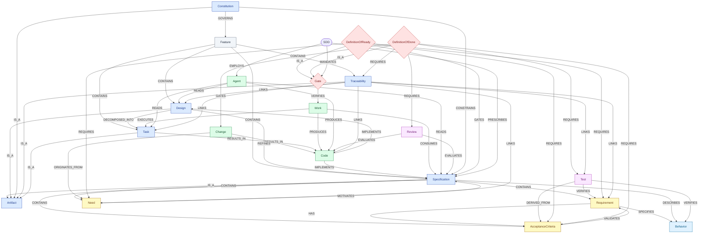

# 13 — Property Graph (21 Entities)

This chapter turns the [glossary](12-glossary.md) into a **property graph** — the kind you would
load into Neo4j. It is the same vocabulary, re-expressed as **nodes** (the entities, each with
properties) and **relationships** (typed, directed edges). Everything here is derived strictly from
the glossary definitions; no new claims are introduced.

The graph has **21 nodes** — the 20 glossary terms plus **Task**, which the glossary names as a
bundle artifact (`tasks.md`) and as a link on the traceability chain (`design → task → code`), even
though it fell just outside the top-20 frequency cut.

> Rule of thumb: a noun is a **node**, a verb between two nouns is a **relationship**, and an
> adjective about a single noun is a **property**. Keep facts on edges, not duplicated on nodes.

---

## 1. Node labels & properties

Every node also carries `name` and `freq` (its glossary occurrence count); domain properties below
come only from the definition text.

| Node (`:Label`) | `freq` | Domain properties |
|---|---|---|
| `:Specification` | 301 | `concern:"what"`, `file:"spec.md"`, `role:"contract"`, `centrality:"hub"`, `statusVocab:[draft,in-review,ready,in-progress,done,superseded]` |
| `:Requirement` | 101 | `idFormat:"FR-<n>/NFR-<n>"`, `syntax:"EARS"`, `modality:"shall/shall not"`, `types:[functional,non-functional]`, `testable:true`, `stableId:true` |
| `:AcceptanceCriteria` | 85 | `outcome:"pass/fail"`, `format:"Given/When/Then (Gherkin)"`, `authoredWhen:"before code"`, `testable:true` |
| `:Test` | 79 | `nature:"automated/executable"`, `purpose:"keep spec true over time"`, `repeatable:true` |
| `:Code` | 79 | `nature:"executable"`, `position:"downstream"`, `role:"decisions executed, not made"` |
| `:SDD` | 70 | `type:"delivery method"`, `principle:"spec-first"`, `tenet:"intent lives in artifacts"` |
| `:Need` | 62 | `aka:"problem"`, `role:"the why"`, `capturedIn:"front-matter / problem statement"` |
| `:Behavior` | 54 | `observability:"external"`, `implementationIndependent:true`, `testable:true` |
| `:Agent` | 53 | `type:"AI coding assistant"`, `example:"Claude Code"`, `role:"literal executor"`, `accountable:false` |
| `:Gate` | 48 | `kind:"quality checkpoint"`, `position:"between phases"`, `effect:"quality as precondition"` |
| `:Feature` | 48 | `idFormat:"NNNN-kebab-case-slug"`, `bounded:true`, `independentlySpecifiable:true`, `role:"unit of organization"` |
| `:Artifact` | 44 | `durable:true`, `versionControlled:true`, `role:"interface between phases/people"`, `lifespan:"outlives conversation"` |
| `:DefinitionOfDone` | 37 | `kind:"exit gate"`, `form:"checklist"`, `criterion:"demonstrably done"` |
| `:DefinitionOfReady` | 37 | `kind:"entry gate"`, `form:"checklist"`, `criterion:"no blocking open questions"` |
| `:Change` | 37 | `unit:"intended modification"`, `state:"intended"`, `costCurve:"cheap as words, expensive as code"` |
| `:Work` | 35 | `nature:"execution effort"`, `precondition:"intent settled"`, `goal:"build the right thing"` |
| `:Design` | 34 | `concern:"how"`, `file:"design.md"`, `level:"structure/interfaces/data"` |
| `:Review` | 33 | `actor:"human"`, `timing:"before advance"`, `cost:"minutes vs rework"` |
| `:Traceability` | 31 | `form:"matrix"`, `chain:"need→requirement→design→task→code→test"`, `detects:"orphans/gaps"` |
| `:Constitution` | 30 | `scope:"project-wide"`, `cardinality:"one per repo"`, `mutability:"amend deliberately"`, `content:"rules/standards/constraints"` |
| `:Task` | 24 | `file:"tasks.md"`, `role:"work breakdown / executable plan"`, `granularity:"small"`, `derivedFrom:"design"`, `ordered:true` |

## 2. Relationship types

Directed `(source)-[:TYPE]->(target)`. Grouped by semantic kind; each edge traces to a sentence in
the glossary.

**Taxonomy — `IS_A`**

| From | → | To |
|---|---|---|
| `:Specification` `:Design` `:Constitution` `:Traceability` `:Task` | `IS_A` | `:Artifact` |
| `:DefinitionOfReady` `:DefinitionOfDone` | `IS_A` | `:Gate` |

**Structure — `CONTAINS` / `HAS`**

| From | Type | To |
|---|---|---|
| `:Feature` | `CONTAINS` | `:Specification`, `:Design`, `:Task`, `:Traceability` |
| `:Specification` | `CONTAINS` | `:Need`, `:Requirement`, `:AcceptanceCriteria` |
| `:Requirement` | `HAS` | `:AcceptanceCriteria` |

**Flow — provenance & production**

| From | Type | To |
|---|---|---|
| `:Need` | `MOTIVATES` | `:Specification` |
| `:Change` | `ORIGINATES_FROM` | `:Need` |
| `:Change` | `RESULTS_IN` | `:Code` |
| `:Design` | `REFINES` | `:Specification` |
| `:Design` | `DECOMPOSED_INTO` | `:Task` |
| `:Task` | `RESULTS_IN` | `:Code` |
| `:Code` | `IMPLEMENTS` | `:Specification`, `:Design` |
| `:Work` | `CONSUMES` | `:Specification` |
| `:Work` | `EXECUTES` | `:Task` |
| `:Work` | `PRODUCES` | `:Code` |
| `:Agent` | `READS` | `:Specification`, `:Design`, `:Task` |
| `:Agent` | `PRODUCES` | `:Code` |

**Verification**

| From | Type | To |
|---|---|---|
| `:Requirement` | `SPECIFIES` | `:Behavior` |
| `:Specification` | `DESCRIBES` | `:Behavior` |
| `:AcceptanceCriteria` | `VALIDATES` | `:Requirement` |
| `:Test` | `DERIVED_FROM` | `:AcceptanceCriteria` |
| `:Test` | `VERIFIES` | `:Requirement`, `:Behavior` |
| `:Review` | `EVALUATES` | `:Specification`, `:Code` |

**Governance & gating**

| From | Type | To |
|---|---|---|
| `:Constitution` | `CONSTRAINS` | `:Specification` |
| `:Constitution` | `GOVERNS` | `:Feature` |
| `:DefinitionOfReady` | `GATES` | `:Specification` |
| `:DefinitionOfDone` | `GATES` | `:Change` |
| `:Gate` | `VERIFIES` | `:Work` |
| `:DefinitionOfReady` | `REQUIRES` | `:Need`, `:Requirement`, `:AcceptanceCriteria` |
| `:DefinitionOfDone` | `REQUIRES` | `:Test`, `:AcceptanceCriteria`, `:Traceability`, `:Review` |

**Traceability spine & method umbrella**

| From | Type | To |
|---|---|---|
| `:Traceability` | `LINKS` | `:Need`, `:Requirement`, `:Design`, `:Task`, `:Code`, `:Test` |
| `:SDD` | `PRESCRIBES` | `:Specification` |
| `:SDD` | `EMPLOYS` | `:Agent` |
| `:SDD` | `MANDATES` | `:Gate` |

## 3. Cypher

Paste into Neo4j Browser. One `CREATE` builds all 21 nodes and every edge in a single transaction.

```cypher
CREATE
  // ── Nodes ─────────────────────────────────────────────────────────────
  (sdd:SDD            {name:'SDD', freq:70, type:'delivery method', principle:'spec-first'}),
  (spec:Specification {name:'Specification', freq:301, concern:'what', file:'spec.md', role:'contract', centrality:'hub'}),
  (req:Requirement    {name:'Requirement', freq:101, idFormat:'FR-<n>/NFR-<n>', syntax:'EARS', modality:'shall/shall not', testable:true, stableId:true}),
  (ac:AcceptanceCriteria {name:'AcceptanceCriteria', freq:85, outcome:'pass/fail', format:'Gherkin', authoredWhen:'before code', testable:true}),
  (test:Test          {name:'Test', freq:79, nature:'automated/executable', repeatable:true}),
  (code:Code          {name:'Code', freq:79, nature:'executable', position:'downstream'}),
  (need:Need          {name:'Need', freq:62, aka:'problem', role:'the why'}),
  (beh:Behavior       {name:'Behavior', freq:54, observability:'external', implementationIndependent:true, testable:true}),
  (agent:Agent        {name:'Agent', freq:53, type:'AI coding assistant', role:'literal executor', accountable:false}),
  (gate:Gate          {name:'Gate', freq:48, kind:'quality checkpoint', position:'between phases'}),
  (feat:Feature       {name:'Feature', freq:48, idFormat:'NNNN-kebab-case-slug', bounded:true, role:'unit of organization'}),
  (art:Artifact       {name:'Artifact', freq:44, durable:true, versionControlled:true, role:'interface'}),
  (dod:DefinitionOfDone  {name:'DefinitionOfDone', freq:37, kind:'exit gate', form:'checklist', criterion:'demonstrably done'}),
  (dor:DefinitionOfReady {name:'DefinitionOfReady', freq:37, kind:'entry gate', form:'checklist', criterion:'no blocking open questions'}),
  (chg:Change         {name:'Change', freq:37, unit:'intended modification', state:'intended'}),
  (work:Work          {name:'Work', freq:35, nature:'execution effort', precondition:'intent settled'}),
  (dsgn:Design        {name:'Design', freq:34, concern:'how', file:'design.md'}),
  (rev:Review         {name:'Review', freq:33, actor:'human', timing:'before advance'}),
  (trace:Traceability {name:'Traceability', freq:31, form:'matrix', detects:'orphans/gaps'}),
  (cons:Constitution  {name:'Constitution', freq:30, scope:'project-wide', cardinality:'one per repo'}),
  (task:Task          {name:'Task', freq:24, file:'tasks.md', role:'work breakdown', granularity:'small', ordered:true}),

  // ── Taxonomy (IS_A) ───────────────────────────────────────────────────
  (spec)-[:IS_A]->(art), (dsgn)-[:IS_A]->(art), (cons)-[:IS_A]->(art),
  (trace)-[:IS_A]->(art), (task)-[:IS_A]->(art),
  (dor)-[:IS_A]->(gate), (dod)-[:IS_A]->(gate),

  // ── Structure (CONTAINS / HAS) ────────────────────────────────────────
  (feat)-[:CONTAINS]->(spec), (feat)-[:CONTAINS]->(dsgn),
  (feat)-[:CONTAINS]->(task), (feat)-[:CONTAINS]->(trace),
  (spec)-[:CONTAINS]->(need), (spec)-[:CONTAINS]->(req), (spec)-[:CONTAINS]->(ac),
  (req)-[:HAS]->(ac),

  // ── Flow (provenance & production) ────────────────────────────────────
  (need)-[:MOTIVATES]->(spec),
  (chg)-[:ORIGINATES_FROM]->(need), (chg)-[:RESULTS_IN]->(code),
  (dsgn)-[:REFINES]->(spec), (dsgn)-[:DECOMPOSED_INTO]->(task),
  (task)-[:RESULTS_IN]->(code),
  (code)-[:IMPLEMENTS]->(spec), (code)-[:IMPLEMENTS]->(dsgn),
  (work)-[:CONSUMES]->(spec), (work)-[:EXECUTES]->(task), (work)-[:PRODUCES]->(code),
  (agent)-[:READS]->(spec), (agent)-[:READS]->(dsgn), (agent)-[:READS]->(task),
  (agent)-[:PRODUCES]->(code),

  // ── Verification ──────────────────────────────────────────────────────
  (req)-[:SPECIFIES]->(beh), (spec)-[:DESCRIBES]->(beh),
  (ac)-[:VALIDATES]->(req),
  (test)-[:DERIVED_FROM]->(ac), (test)-[:VERIFIES]->(req), (test)-[:VERIFIES]->(beh),
  (rev)-[:EVALUATES]->(spec), (rev)-[:EVALUATES]->(code),

  // ── Governance & gating ───────────────────────────────────────────────
  (cons)-[:CONSTRAINS]->(spec), (cons)-[:GOVERNS]->(feat),
  (dor)-[:GATES]->(spec), (dod)-[:GATES]->(chg), (gate)-[:VERIFIES]->(work),
  (dor)-[:REQUIRES]->(need), (dor)-[:REQUIRES]->(req), (dor)-[:REQUIRES]->(ac),
  (dod)-[:REQUIRES]->(test), (dod)-[:REQUIRES]->(ac),
  (dod)-[:REQUIRES]->(trace), (dod)-[:REQUIRES]->(rev),

  // ── Traceability spine & method umbrella ──────────────────────────────
  (trace)-[:LINKS]->(need), (trace)-[:LINKS]->(req), (trace)-[:LINKS]->(dsgn),
  (trace)-[:LINKS]->(task), (trace)-[:LINKS]->(code), (trace)-[:LINKS]->(test),
  (sdd)-[:PRESCRIBES]->(spec), (sdd)-[:EMPLOYS]->(agent), (sdd)-[:MANDATES]->(gate);
```

## 4. Mermaid diagram

Renders on GitHub. Nodes are colored by role; edge labels are the relationship types.



---

This is a reference appendix derived from the [glossary](12-glossary.md). Return to the
[README](../README.md) for the table of contents.
